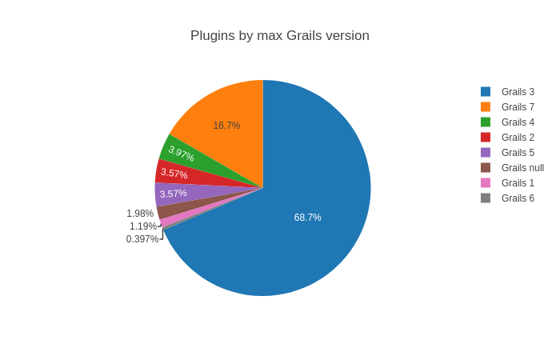
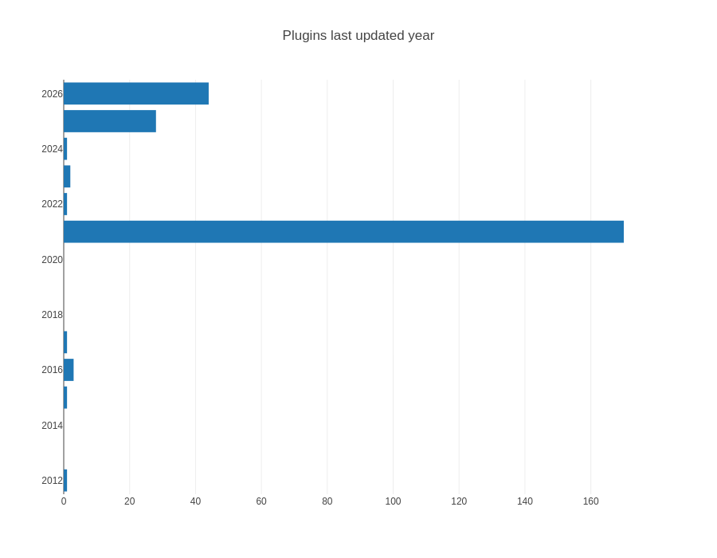

# Grails Plugins Metadata

Requires [Groovy](https://groovy-lang.org/) 4+ 

Draws a pie chart showing [plugins](https://grails.apache.org/plugins.html) and what major version of [Grails](https://grails.apache.org/) they support

    ./grailsVersion.groovy

Example output:

Draws a bar chart showing plugin updates by year

    ./releaseYear.groovy

Example output:

